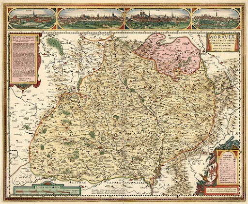
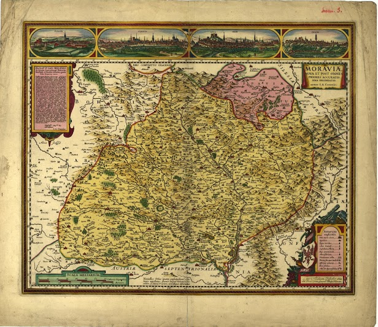

Installation {#ch:installation}
============

In this chapter, we show steps necessary to install and run a sample web
utility, which allows to retrieve images based on their content. To meet
this purpose we will use content-based image retrieval library called
**LIRE** (**L**ucene **I**mage **RE**trieval). This library provides
methods for indexing and searching images. The LIRE uses for these
purposes full text search engine library called **Apache Lucene**. Since
we want to create the web application, we use for image retrieving
search web-based platform **Apache Solr**, based on the Apache Lucene.

Apache Solr Setup
-----------------

Apache Solr is an open source enterprise search platform. It is written
in Java and runs as a standalone full-tex search server within a servlet
container such as Jetty. Solr has REST-like HTTP/XML and JSON API to
obtain and index data.@solr

### Installation {#installation}

At first we need to download the Solr from its web page[^1]. Solr
requires for running Java version 1.6 or greater.

[H]

java -version

We begin by unzipping the Solr release and copying the **example**
directory to the installed folder. Then we need to copy also directories
**contrib** and **dist** to our project and then we have to change
class-path for these files. All steps we demonstrate in the listing
[lst:solrInstallation].

[H] [lst:solrInstallation]

unzip solr-X.X.X.zip mkdir -p /path/to/project/directory \# copying
example directory cp -r solr-X.X.X/example /path/to/project/directory \#
copying contrib and dist directories cp -r solr-X.X.X/contrib
/path/to/project/directory/example cp -r solr-X.X.X/dist
/path/to/project/directory/example cd /path/to/project/directory \#
renaming example to solr mv example solr

Now when Solr is successfully installed, we have to create and configure
a new solr core. The solr cores are located in the directory called
**solr**. In this directory it already exists a pre created default core
with the name **collection1**. We can simply rename this core. After the
renaming, we need to specify its properties in the **core.properties**
file. We can just simply replace all file by the settings in the listing
[lst:coreProp].

[H]

\# You can check if your actual working directory is \#
/path/to/project/solr pwd \# We change our working directory to the solr
\# directory where cores are located. cd solr \# Now we can rename core
with name collection1 \# to liresolr. mv collection1 liresolr \# Again
we change our working directory to the liresolr cd liresolr \# Now we
can edit core.properties file vim core.properties

[H] [lst:coreProp]

name=identity config=solrconfig.xml schema=schema.xml dataDir=data

We mentioned that we have to change class-path for the **contrib** and
**dist** directories. We can do it in the **solrconfig.xml**, which is
located in the */path/to/project/solr/solr/[core]/conf/solrconfig.xml*.
So we replace following lines.

[H]

\<lib dir=“../../../contrib/extraction/lib” regex=“.\*jar” /\> \<lib
dir=“../../../dist/” regex=“solr-cell-.\*jar” /\>

\<lib dir=“../../../contrib/clustering/lib/” regex=“.\*jar” /\> \<lib
dir=“../../../dist/” regex=“solr-clustering-.\*jar” /\>

\<lib dir=“../../../contrib/langid/lib/” regex=“.\*jar” /\> \<lib
dir=“../../../dist/” regex=“solr-langid-.\*jar” /\>

\<lib dir=“../../../contrib/velocity/lib” regex=“.\*jar” /\> \<lib
dir=“../../../dist/” regex=“solr-velocity-.\*jar” /\>

[H]

\<lib dir=“../../contrib/extraction/lib” regex=“.\*jar” /\> \<lib
dir=“../../dist/” regex=“solr-cell-.\*jar” /\>

\<lib dir=“../../contrib/clustering/lib/” regex=“.\*jar” /\> \<lib
dir=“../../dist/” regex=“solr-clustering-.\*jar” /\>

\<lib dir=“../../contrib/langid/lib/” regex=“.\*jar” /\> \<lib
dir=“../../dist/” regex=“solr-langid-.\*jar” /\>

\<lib dir=“../../contrib/velocity/lib” regex=“.\*jar” /\> \<lib
dir=“../../dist/” regex=“solr-velocity-.\*jar” /\>

Now we can run the jetty server and we can see a solr admin page on the
*<http://localhost:8983/solr/>*.

[H]

cd /path/to/project/solr java -jar start.jar

Lire Setup
----------

The LIRE (Lucene Image REtrieval) library provides a simple way to
retrieve images and photos based on their color and texture
characteristics. LIRE creates a Lucene index of image features for
content based image retrieval (CBIR).@lire

### Compilation

At first, we need to download and compile LIRE handlers. We can do it in
two simple steps. We have to clone git repository to our local computer
and then we use ant build script to build the project. After it we
should see in the **dist** directory the **lire-request-handler.jar**
file.

[H]

\# clone repository git clone
https://github.com/moravianlibrary/liresolr cd liresolr \# build project
and create a jar file ant dist

### Integration to the Solr

After we compile LIRE project, we have to integrate jar package in the
Solr class-path. At first we have to copy **lire-request-handler.jar**
to the Solr project and then we need to configure class-path for these
files (see listings [lst:copyLireRequestHandler] and
[lst:setClassPath]). We can specify it in the **solrconfig.xml**[^2].

[H] [lst:copyLireRequestHandler]

\# change working directory to solr cd /path/to/project/solr mkdir
handlers \# change working directory to liresolr cd
/path/to/project/liresolr \# copy lire-request-handler.jar and libraries
to the solr cp -r dist/lire-request-handler.jar lib ../solr/handlers

[H] [lst:setClassPath]

\<config\> \<lib dir=“../../handlers” regex=“.\*jar” /\> \<lib
dir=“../../handlers/lib” regex=“.\*jar” /\> \</config\>

Now when we have LIRE handlers in the class-path we register them in the
**solrconfig.xml** file.

[H]

\<config\> \<requestHandler name=“/lireId”
class=“net.semanticmetadata.lire.solr.requesthandler.
IdentityRequestHandler”\> \<lst name=“defaults”\> \<str
name=“echoParams”\>explicit\</str\> \<str name=“wt”\>json\</str\> \<str
name=“indent”\>true\</str\> \</lst\> \</requestHandler\>
\<requestHandler name=“/lireSim”
class=“net.semanticmetadata.lire.solr.requesthandler.
SimilarRequestHandler”\> \<lst name=“defaults”\> \<str
name=“echoParams”\>explicit\</str\> \<str name=“wt”\>json\</str\> \<str
name=“indent”\>true\</str\> \</lst\> \</requestHandler\> \</config\>

In this tutorial we use only two handlers, which we will use to request
identical or similar image. If you want to know more about using LIRE
Solr integration you can see@liresolr.

We also need to define fields in the **schema.xml**, in which the Solr
will store the data about images. For storing data about images we will
use two types of information. First will have suffix **\_ha** and it
will represents a hash of image, which the Solr need for fast searching.
This information will be a text type. Second type of information will be
a binary type and it will be used to store some data, which will
represents the image. These fields will have suffix **\_hi**. To
retrieve images we will combine two different methods – Color layout and
SURF (Speeded Up Robust Features) image descriptor. Because of these
facts we have to specify four fields to store data about images. In this
specification we define our own field so we cannot forget to add the
definition of the custom field at the same field (see listings
[lst:schemaSpec] and [lst:binaryDVDef]).

[H] [lst:schemaSpec]

\<fields\> \<!– file path for ID –\> \<field name=“id” type=“string”
indexed=“true” stored=“true” required=“true” multiValued=“false” /\>
\<!– Needed for SOLR –\> \<field name=“text” type=“text~g~eneral”
indexed=“true” stored=“false” multiValued=“true”/\> \<!– ColorLayout –\>
\<field name=“cl~h~a” type=“text~w~s” indexed=“true” stored=“false”
required=“false”/\> \<field name=“cl~h~i” type=“binaryDV”
indexed=“false” stored=“true” required=“false”/\> \<!– SURF –\> \<field
name=“su~h~a” type=“text~w~s” indexed=“true” stored=“false”
required=“false”/\> \<field name=“su~h~i” type=“binaryDV”
indexed=“false” stored=“true” required=“false”/\> \<!– Needed for SOLR
–\> \<field name=“\_version\_” type=“long” indexed=“true”
stored=“true”/\> \</fields\>

[H] [lst:binaryDVDef]

\<types\> \<fieldtype name=“binaryDV”
class=“net.semanticmetadata.lire.solr.BinaryDocValuesField”/\>
\</types\>

On the end we will have to add configuration file
**liresolr.properties** to the config directory of your solr core[^3].
We will speak more about configuration in the next chapters.

[H]

\# It defines how many images will be obtained from solr \# and then
they will be compared \# with the queried image. \# Visual Words
numVisualWordsImages = 30 \# Color Layout numColorLayoutImages = 2000 \#
It defines how many images will be obtained from solr \# at similar
searching (/lireSim) numColorLayoutSimImages = 10 numSurfSimImages = 30
\# Count of images returned by /lireSim handler: numSimilarImages = 30
\# It defines if system should resize queried image. \# Parameter
defines shorter side of the image. \# You can use value 0 for no resize.
resizeQueryImage = 400 \# It defines treshold of Color Layout method.
Images, \# which have the distance less than the \# threshold, will be
marked as potentional identical \# images to the queried image.
thresholdCLIdentity1 = 7.0 \# It defines the second level of threshold.
If it exists \# exactly one image, which has \# distance less than first
threshold and it has also \# distance less than the second \# threshold,
system says, that this image is identical \# to the queried image.
thresholdCLIdentity2 = 5.0 \# It defines threshold of the SURF method.
Images which \# have distance greater or equals \# to this value will be
removed from a list of candidates \# to the identical image.
thresholdSUIdentity = 0.9

Indexing Images
---------------

We can index images using by various methods. More information about
indexing image data you can find here@createIndex. If we would want to
create our own application for indexing images, it is very important to
use the same jar file **lire.jar**, which is used by solr handlers,
because this library contains data, which are used to generate hash
functions. For our purposes we can use a simple indexer, which extracts
data from images using by Color Layout and SURF method. It also provides
method to import this data to the Solr server. We can easily download it
from the git repository
<https://github.com/moravianlibrary/liresolrindexer>. (See listing
[lst:liresolrindexer])

[H] [lst:liresolrindexer]

\# clone repository git clone
https://github.com/moravianlibrary/liresolrindexer cd liresolrindexer \#
create jar package ant package

Now we will need a directory, which will contain images. We can create
it in our project folder and we can call it **data**. Then we move all
images for indexing to this folder. We also copy our **indexer.jar**
from *liresolrindexer/dist* directory. We cannot forget copy the **lib**
folder due to dependencies. In the same directory has to be a
**config.propeties** file (see listing [lst:configFile]), which contains
indexer configuration. We check and properly set these properties before
indexing process. All neccesary information about configuration are in
this file.

[H] [lst:configFile]

\# Url to the solr core, where indexer will import data. solrCoreUrl =
http://localhost:8983/solr/liresolr \# Path to the solr core data
folder, \# where indexer copy clusters-surf.dat. solrCoreData =
/path/to/project/solr/solr/liresolr/data \# Number of the documents,
which will be used to create \# vocabulary (clusters-surf.dat).
numDocsForVocabulary = 800 \# This is equivalent to a number of the
visual words, \# which will be used to search images. numClusters = 1000
\# Number of threads, which will be used to index images.
numberOfThreads = 2

Since indexer accepts like parameter a file, which contains list of
images for indexing, we have to create simple text file, in which will
be represent each line one path to the image. We can do it by many ways.
See listing [lst:creatingImagesList].

[H] [lst:creatingImagesList]

find . -name “\*.jpg” \> images

Finally we can type following command.

[H]

java -jar indexer.jar index images

After the indexing process we have to import the generated data to the
Solr server. Indexer reads information about the server from
**config.properties** file so we should properly set these properties.
Then we can simple use the command from the listing [lst:importData].
For more information about this tool see@indexer.

[H] [lst:importData]

java -jar indexer.jar import

Simple Web Application
----------------------

The last step will be adding a simple web application to the Jetty
server. This application will allow a user to insert the requested image
and then it will display information obtained from the server. Our
**LireSolr** project already contains this simple web app so we will
show how to create a war package, which we deploy to the Jetty and how
to properly set some other properties.

Firstly, we need to create war package. We just change our working
directory to the */path/to/project/liresolr* and then we run the ant
script. If compilation process was successful, we can find **web.war**
file in the **dist** directory.

[H]

ant web

Secondly, we have to integrate the war package into the Jetty server. We
just simply copy the file into the **webapp** folder and then we add a
context description for this file. We can do it like this.

[H]

cd /path/to/project/solr cp ../liresolr/dist/web.war webapps cd contexts
vim web-context.xml

[H]

\<?xml version=“1.0”?\> \<!DOCTYPE Configure PUBLIC
“-//Jetty//Configure//EN” “http://www.eclipse.org/jetty/configure.dtd”\>
\<Configure class=“org.eclipse.jetty.webapp.WebAppContext”\> \<Set
name=“contextPath”\>/lire\</Set\> \<Set name=“war”\> \<SystemProperty
name=“jetty.home”/\>/webapps/web.war \</Set\> \</Configure\>

Thirdly, the web page expects that it can access to the image data on
the context path **/lire/data**. So we have to allow the access on this
url. We can do it by adding the next xml descriptor to the **contexts**
directory. We can call it for example **data-context.xml**. See listing
[lst:data-context]. After these steps we should be able to connect to
the <localhost:8983/lire>. Now we can try to find some image.

[H] [lst:data-context]

\<?xml version=“1.0” encoding=“ISO-8859-1”?\> \<!DOCTYPE Configure
PUBLIC “-//Mort Bay Consulting//DTD Configure//EN”
“http://jetty.eclipse.org/configure.dtd”\> \<Configure
class=“org.eclipse.jetty.server.handler.ContextHandler”\> \<Set
name=“contextPath”\>/lire/data\</Set\> \<Set
name=“resourceBase”\>/path/to/project/data\</Set\> \<Set
name=“handler”\> \<New
class=“org.eclipse.jetty.server.handler.ResourceHandler”\> \<Set
name=“directoriesListed”\>false\</Set\> \<Set
name=“cacheControl”\>max-age=3600,public\</Set\> \</New\> \</Set\>
\</Configure\>

Development
===========

“The main goal of content-based image retrieval is to find similar
images. While similarity itself is a concept that is hard to formalize,
the problem is compounded by the need for comparing millions of images
to a query image at search time – a very challenging task. A common
approach consists in representing images using the minimal amount of
information needed to encode its essential properties.This minimal
information – called image descriptor – is usually extracted from the
image’s raw pixel values (and their coordinates) – a process known as
feature extraction – and encoded in a numeric vector, the feature
vector. Similarity, then, is defined by a suitable metric that computes
a distance between two vectors. The design, extraction, and encoding of
the image features as well as the choice of the metric makes up for a
mathematical representation of visual similarity”@VIRbook [s. 30].

In this chapter we introduce some technique how to extract the minimal
information from the image – called image descriptor. Then we will
compare these methods and we will show how to combine it together to use
the best from the each method. During the all research we will focus on
the map comparing. We will search techniques how to efficiently find
identical or similar maps.

Image Descriptor
----------------

"Ideally, descriptors should be:

-   **representative** of the contents of the image (or region) from
    which they were extracted,

-   **robust** to image rotation, scaling, or translation (often
    referred to as RST invariant in the computer vision literature),

-   **compact**, since the number of dimensions and the range of
    possible values along each dimension are critical to search time
    behavior"@VIRbook [s. 30].

Now we have to realize how we will retrieve the image data. In the
chapter [ch:installation] we said that we use for the image retrieving
the Apache Solr server, which is the search platform, which includes
powerful full-text search. Therefore, our goal will be creating the
descriptor, which we could transform into the textual information.
Although, we are able to find similar images based on the text
information, we also want to compute a distance value from the queried
image. This information will said how the images are similar to this
image. To compute such information we will need to store data, from
which we could compute later this value. Below we will be called the
textual information as a **hash** and the information, which will be
represented the image, we will be called a **histogram**.

Color Layout
------------

This method uses to extract the image descriptor a color information
from the picture. Big advantage of this fact is that we can very fast
compute such information. Descriptor is represented by the color
histogram. It is the most intuitive visual descriptor. We can imagine it
like an array of real values. The question is, how this information can
be transformed into the textual form. The biggest problem is that the
real numbers can have infinite number of values[^4] and we represent the
textual information with just small subset of the natural numbers. So we
have to map the bigger set of values to the smaller set. For this
purpose we can use the hash function. Advantage of this method is that
it is very fast. By this way we can compute the hash information
mentioned in the introduction of this section.

To create a histogram we can use the color histogram, which we used to
compute the hash. This we can use this information later to compute the
distance between images. You can read here@ColorLayout more about
computing of the distance.

SURF
----

“SURF is a performance-oriented scale and rotation-invariant interest
point detector and descriptor. Its performance with respect to
repeatability, distinctiveness, and robustness”@VIRbook [s. 42].

SURF uses to create the image descriptor a local feature. It is usually
associated with a change of one or more image properties, such as
intensity, color, and texture. Local features can be interest points,
corners, edges, or salient spots. If we want to integrate this technique
we have to transform these local features into the textual information,
which will represents the image. We can do it in the following steps.

1.  We choose some sample images and we extract from them the local
    features. We can image these features like points in some vector
    space. Sometimes it is called as interest points.

2.  We distribute this points into clusters. We use for this purpose a
    method called **k-means clustering**[^5].

3.  We assign to the each cluster a string. For example the first
    cluster will be *v0*, the second cluster will be *v1* and so on.

4.  We take a sequence of the local features from the image and then we
    assign to them strings, based on the clusters, into the which they
    belong. So we get a sequence of words, which we can called **visual
    words**.

Based on the visual words, we can get from the Solr server set of
images, which are similar to the queried image. Although by this way we
get good results, the searched image may not always appear on the first
place. Because of improvement of results, we have to compare each image
point by point[^6]. We have two set of points and we have to find pairs
of similar points. We define similar points so that if distance between
two points is less than some constant, the points are similar. By this
method we have to perform (n x m) operations. Computation of distance by
this way is very slow. We try to do some optimization, but in the future
this problem should be solved with the more sophisticated algorithm. The
main idea of this optimization is to sort the interest points and so
speed up searching a similar points. Optimized process of comparing
performs in following steps.

1.  We compute for each point a distance from a vector (1,1,1...1). We
    cannot compute it from a vector (0,0,0...0) because the interest
    points are normalized.

2.  We sort these points based on this computed distance.

3.  We take one point from the first image and we find some neighborhood
    of points, which have similar distance from the vector (1,1,1...1),
    in the second image. We use binary search algorithm to find this
    neighborhood.

4.  We compare the point from the first image with the founded points
    from the second image.

Tests {#sec:tests}
-----

In this section we will test mentioned method to create image
descriptor. We will talk about their advantages and disadvantages and on
the end we will summarize our observations.

### Color Layout

During testing we tried to find similar images by each method
separately. It has been shown that the Color Layout is very fast, it can
return a result in less than one second, and it is reliable to find an
identical image. It returned a correct result in the each test. Results
of the tests are shown in the table [tab:colorLayoutTest]. Although
differences between first and second image are big enough, there are
some cases, when these differences are small. In these situations we
cannot surely say that it exists an identical image and that it is the
first image.

|m7cm|r|r|

[tab:colorLayoutTest]\

&\
URL & First image & Second image\
&\
URL & First image & Second image\
<http://mapy.mzk.cz/tmp/duplicity-test/orig/2619267582.jpg> & 3.1462643
& 7.6242585\
<http://mapy.mzk.cz/tmp/duplicity-test/orig/2619267505a.jpg> & 1.4142135
& 9.518843\
<http://mapy.mzk.cz/tmp/duplicity-test/orig/2619267580.jpg> & 1.0 &
6.358899\
<http://mapy.mzk.cz/tmp/duplicity-test/orig/2619267578a.jpg> & 3.4142137
& 7.0318995\
<http://mapy.mzk.cz/tmp/duplicity-test/orig/2619267576.jpg> & 2.4142137
& 7.1046295\
<http://mapy.mzk.cz/tmp/duplicity-test/orig/2619267574.jpg> & 3.1462643
& 7.63103\
<http://mapy.mzk.cz/tmp/duplicity-test/orig/2619267572.jpg> & 2.0 &
8.056606\
<http://mapy.mzk.cz/tmp/duplicity-test/orig/2619267570.jpg> & 3.3166249
& 7.322473\
<http://mapy.mzk.cz/tmp/duplicity-test/orig/2619267567.jpg> & 3.3166249
& 8.071068\
<http://mapy.mzk.cz/tmp/duplicity-test/orig/2619267565.jpg> & 5.595754 &
6.768857\
<http://mapy.mzk.cz/tmp/duplicity-test/orig/2619267564.jpg> & 4.5604777
& 7.0\
<http://mapy.mzk.cz/tmp/duplicity-test/orig/2619267555.jpg> & 2.0 &
6.210045\
<http://mapy.mzk.cz/tmp/duplicity-test/orig/2619267658.jpg> & 3.732051 &
5.878315\
<http://mapy.mzk.cz/tmp/duplicity-test/orig/2619267604.jpg> & 1.4142135
& 8.658535\
<http://mapy.mzk.cz/tmp/duplicity-test/orig/2619267603a.jpg> & 3.732051
& 6.7993784\
<http://mapy.mzk.cz/tmp/duplicity-test/orig/2619267600.jpg> & 5.1462646
& 6.656854\

Disadvantage of this method is that it searches images based on the
color and then it cannot find the same image, which is scanned on
another scanner. Differences between such two images are illustrated in
the figure [fig:identicalMaps]. In this case, the Color Layout cannot
find the indexed map.

0.5 
[fig:indexedMap]

0.5 
[fig:searchedMap]

[fig:identicalMaps]

### SURF

When we tried SURF method on the set of the images from the previous
section, results was surprising. SURF cannot find almost any image.
Problem was that the indexed images are thumbnails with the small
resolution and the searched images had bigger resolution. In these
images were found more interest points than in the indexed and it caused
that was generated different sequences of visual words. When we scaled
the searched image into the same resolution like had the indexed images,
we got much better results. System was able even recognize similarity
between images in the figure [fig:identicalMaps].

Main disadvantage is that the whole search process took several times
more time compared to Color Layout method. For example, while the Color
Layout searched an image less than one second, the SURF searched this
image more than nine seconds.

### Summary

The choice of the image descriptor depends on our expectations from a
system. If we want to find identical image, which is just scaled, we can
use the Color Layout descriptor, which is very fast. On the other hand
if we want to find some similarity between images and we are willing to
wait a few seconds, SURF method is better choice. But we have to
realize, that we do not have to use only one technique but we can
combine it so that we use the best from the each method.

Implementation
==============

In this chapter we will show how we implemented handlers, which search
identical or similar images based on the image information. We will
explain step by step how the whole process works. During the explanation
we will also say something about constants, which we can set in the
configuration files (see chapter [ch:installation]).

Identity
--------

The process of searching identical image combines together both methods
– Color Layout and SURF. It should be as fast as possible, but on the
other hand it should be able to surely say, if some image exists in the
system or not. For this purpose we have to define some thresholds, which
will be determined, which image is identical and which is not. We use
the data from the section [sec:tests].

Procedure, how the handler evaluates if the identical image is in the
system or not:

1.  Based on the color hash, the Solr finds 2000 images[^7].

2.  Based on the color histogram, all founded images are compared with
    the searched image and it choose images, which have the distance
    less than 7.0[^8].

3.  If there is no such a image, result is that it does not exist
    identical image.

4.  If there is exactly one image and distance is less than 5.0[^9],
    result is, that it exists identical image and that it is this one.

5.  If there is exactly one image and distance is greater or equal than
    5.0, it computes distance between images by the SURF method. If the
    distance is less than 0.9[^10], image is considered as identical.
    Otherwise, the system says, that there is no identical image.

6.  If there is more than one image, it computes the distance for all
    images by the SURF method. Images, which have distance greater or
    equal to 0.9, will be removed from list of candidates to the
    identical image. If the list will be empty after this step, result
    will be that there is no identical image. Otherwise, it computes the
    new distance as *Color Layout distance* x *SURF distance* and the
    image with the smallest distance will be returned as the identical
    image.

Similarity
----------

Similar like in the identity handler, we will use both methods to get
similar images from the Solr. Process, which searches these images, is
more straightforward. Firstly we find by the color hash 10 images[^11]
and 30 images[^12] by the SURF hash. Secondly we compute distances by
the SURF histograms (comparing interest points) and on the end we sort
these images based on the computed distance.

[^1]: <http://lucene.apache.org/solr/mirrors-solr-latest-redir.html>

[^2]: You can find it in */path/to/project/solr/solr/liresolr/conf*
    directory

[^3]: Into the same directory where it is the solrconfig.xml

[^4]: We know that the computer cannot actually store all real numbers,
    but for simplicity we suppose that it can.

[^5]: <http://en.wikipedia.org/wiki/K-means_clustering>

[^6]: We mean interest points

[^7]: This value is stored in the lire.properties file under key
    *numColorLayoutImages*

[^8]: *thresholdCLIdentity1*

[^9]: *thresholdCLIdentity2*

[^10]: *thresholdSUIdentity*

[^11]: *numColorLayoutSimImages*

[^12]: *numSurfSimImages*
